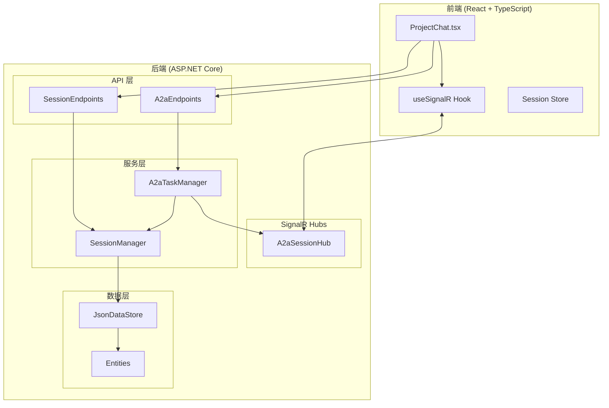
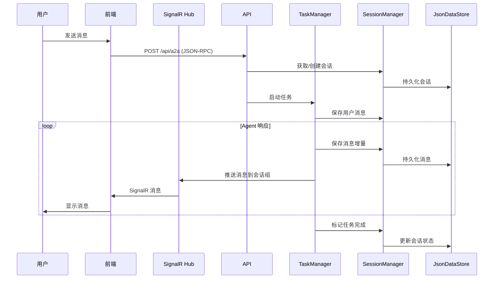

# 设计文档：A2A 会话管理重构

## 概述

本设计将现有的 A2A 任务管理系统从内存存储 + SSE 流式推送架构重构为持久化存储 + SignalR 实时推送架构。核心改动包括：

1. 新增会话（Session）和会话消息（SessionMessage）实体
2. 扩展 ProjectEntity 以支持当前会话绑定
3. 引入 SignalR Hub 替代 SSE 进行实时消息推送
4. 前端集成 SignalR 客户端，支持断线重连和历史消息加载

## 架构

### 整体架构图



### 消息流程图



## 组件与接口

### 后端组件

#### 1. SessionManager（会话管理器）

负责会话的生命周期管理和消息持久化。

```csharp
public interface ISessionManager
{
    // 会话管理
    Task<SessionEntity> GetOrCreateSessionAsync(Guid projectId, CancellationToken ct);
    Task<SessionEntity?> GetSessionAsync(Guid sessionId, CancellationToken ct);
    Task<IReadOnlyList<SessionEntity>> GetProjectSessionsAsync(Guid projectId, CancellationToken ct);
    Task UpdateCurrentSessionAsync(Guid projectId, Guid sessionId, CancellationToken ct);
    
    // 消息管理
    Task<SessionMessageEntity> AddMessageAsync(Guid sessionId, SessionMessageRole role, string content, CancellationToken ct);
    Task AppendMessageContentAsync(Guid messageId, string contentDelta, CancellationToken ct);
    Task<IReadOnlyList<SessionMessageEntity>> GetMessagesAsync(Guid sessionId, int limit, Guid? beforeId, CancellationToken ct);
    
    // 状态管理
    Task UpdateSessionStatusAsync(Guid sessionId, SessionStatus status, CancellationToken ct);
}
```

#### 2. A2aSessionHub（SignalR Hub）

处理实时消息推送。

```csharp
public class A2aSessionHub : Hub
{
    // 客户端调用
    public Task JoinSessionAsync(string sessionId);
    public Task LeaveSessionAsync(string sessionId);
    
    // 服务端推送方法（通过 IHubContext 调用）
    // - SendTextDelta(sessionId, messageId, delta)
    // - SendStatusUpdate(sessionId, status)
    // - SendToolCall(sessionId, toolName, toolArgs)
    // - SendError(sessionId, error)
    // - SendMessageComplete(sessionId, messageId)
}
```

#### 3. SessionEndpoints（会话 API）

```csharp
public static class SessionEndpoints
{
    // POST /api/sessions - 创建新会话
    // GET /api/sessions/{sessionId} - 获取会话详情
    // GET /api/sessions/{sessionId}/messages - 获取会话消息（分页）
    // GET /api/projects/{projectId}/sessions - 获取项目的所有会话
    // PUT /api/projects/{projectId}/current-session - 切换当前会话
}
```

### 前端组件

#### 1. useSignalR Hook

管理 SignalR 连接生命周期。

```typescript
interface UseSignalROptions {
  sessionId: string | null;
  onTextDelta: (messageId: string, delta: string) => void;
  onStatusUpdate: (status: SessionStatus) => void;
  onToolCall: (toolName: string, toolArgs: unknown) => void;
  onError: (error: string) => void;
  onMessageComplete: (messageId: string) => void;
}

function useSignalR(options: UseSignalROptions): {
  connectionState: HubConnectionState;
  joinSession: (sessionId: string) => Promise<void>;
  leaveSession: (sessionId: string) => Promise<void>;
};
```

#### 2. Session API Client

```typescript
interface SessionApi {
  createSession(projectId: string): Promise<SessionDto>;
  getSession(sessionId: string): Promise<SessionDto>;
  getMessages(sessionId: string, limit?: number, beforeId?: string): Promise<SessionMessageDto[]>;
  getProjectSessions(projectId: string): Promise<SessionDto[]>;
  setCurrentSession(projectId: string, sessionId: string): Promise<void>;
}
```

## 数据模型

### 实体定义

#### SessionEntity（会话实体）

```csharp
public sealed class SessionEntity
{
    public Guid Id { get; set; } = Guid.NewGuid();
    public Guid ProjectId { get; set; }
    public SessionStatus Status { get; set; } = SessionStatus.Active;
    public DateTimeOffset CreatedAtUtc { get; set; } = DateTimeOffset.UtcNow;
    public DateTimeOffset UpdatedAtUtc { get; set; } = DateTimeOffset.UtcNow;
}

public enum SessionStatus
{
    Active = 0,
    Completed = 1,
    Failed = 2,
    Cancelled = 3
}
```

#### SessionMessageEntity（会话消息实体）

```csharp
public sealed class SessionMessageEntity
{
    public Guid Id { get; set; } = Guid.NewGuid();
    public Guid SessionId { get; set; }
    public SessionMessageRole Role { get; set; }
    public string Content { get; set; } = "";
    public string? MessageType { get; set; }  // text, tool_call, tool_result, status
    public string? Metadata { get; set; }      // JSON 格式的额外数据
    public DateTimeOffset CreatedAtUtc { get; set; } = DateTimeOffset.UtcNow;
}

public enum SessionMessageRole
{
    User = 0,
    Agent = 1,
    System = 2
}
```

#### ProjectEntity 扩展

```csharp
public sealed class ProjectEntity
{
    // ... 现有字段 ...
    
    // 新增字段
    public Guid? CurrentSessionId { get; set; }
}
```

### DTO 定义

```typescript
// 前端类型定义
interface SessionDto {
  id: string;
  projectId: string;
  status: 'active' | 'completed' | 'failed' | 'cancelled';
  createdAtUtc: string;
  updatedAtUtc: string;
}

interface SessionMessageDto {
  id: string;
  sessionId: string;
  role: 'user' | 'agent' | 'system';
  content: string;
  messageType?: string;
  metadata?: Record<string, unknown>;
  createdAtUtc: string;
}
```

### 数据存储结构

会话数据将存储在 JSON 文件中：

```
{dataDirectory}/
├── projects.json          # 现有
├── providers.json         # 现有
├── tool-settings.json     # 现有
├── sessions.json          # 新增：会话列表
└── session-messages/      # 新增：会话消息目录
    ├── {sessionId-1}.json
    ├── {sessionId-2}.json
    └── ...
```

### SignalR 消息格式

```typescript
// 文本增量消息
interface TextDeltaMessage {
  type: 'textDelta';
  messageId: string;
  delta: string;
}

// 状态更新消息
interface StatusUpdateMessage {
  type: 'statusUpdate';
  status: SessionStatus;
  message?: string;
}

// 工具调用消息
interface ToolCallMessage {
  type: 'toolCall';
  messageId: string;
  toolName: string;
  toolArgs: unknown;
  toolUseId?: string;
}

// 错误消息
interface ErrorMessage {
  type: 'error';
  error: string;
  code?: number;
}

// 消息完成
interface MessageCompleteMessage {
  type: 'messageComplete';
  messageId: string;
  finalContent: string;
}
```


## 正确性属性

*正确性属性是系统在所有有效执行中应该保持为真的特征或行为——本质上是关于系统应该做什么的形式化陈述。属性作为人类可读规范和机器可验证正确性保证之间的桥梁。*

### Property 1: 消息持久化 Round-Trip

*对于任意* 会话和任意消息内容，将消息保存到会话后，通过会话 ID 加载消息应该能够获取到相同的消息内容。

**Validates: Requirements 1.3, 1.5, 6.2, 6.3**

### Property 2: 会话创建唯一性

*对于任意* 项目，创建多个会话时，每个会话应该有唯一的 ID，且所有会话都能通过项目 ID 查询到。

**Validates: Requirements 1.4, 2.4**

### Property 3: 会话切换更新

*对于任意* 项目和该项目下的任意会话，切换到该会话后，项目的 CurrentSessionId 应该等于目标会话的 ID。

**Validates: Requirements 2.2, 2.5**

### Property 4: 当前会话加载

*对于任意* 设置了 CurrentSessionId 的项目，获取项目信息时应该能够获取到正确的当前会话数据。

**Validates: Requirements 2.3**

### Property 5: 消息分页查询

*对于任意* 包含 N 条消息的会话，请求 limit=M 条消息时，应返回 min(N, M) 条消息，且使用 beforeId 游标时应返回该消息之前的消息。

**Validates: Requirements 5.1, 5.2, 5.4**

### Property 6: 断线重连消息恢复

*对于任意* 会话和任意消息序列，给定上次接收的消息 ID，加载后续消息应该返回该 ID 之后的所有消息，不遗漏也不重复。

**Validates: Requirements 3.5**

## 错误处理

### 后端错误处理

| 错误场景 | 处理方式 | HTTP 状态码 |
|---------|---------|------------|
| 会话不存在 | 返回 404 或自动创建新会话 | 404 / 201 |
| 项目不存在 | 返回错误信息 | 404 |
| 消息保存失败 | 记录日志，通过 SignalR 推送错误 | - |
| SignalR 连接失败 | 客户端自动重连 | - |
| JSON 文件读写失败 | 抛出异常，记录日志 | 500 |

### 前端错误处理

| 错误场景 | 处理方式 |
|---------|---------|
| SignalR 连接断开 | 显示连接状态，自动重连 |
| 消息加载失败 | 显示错误提示，提供重试按钮 |
| 会话创建失败 | 显示错误提示 |
| 网络超时 | 显示超时提示，自动重试 |

### 错误消息格式

```typescript
interface ApiError {
  code: string;
  message: string;
  details?: Record<string, unknown>;
}
```

## 测试策略

### 单元测试

单元测试用于验证具体示例和边界情况：

1. **SessionManager 测试**
   - 创建会话返回正确的实体结构
   - 空会话返回空消息列表
   - 无效会话 ID 返回 null

2. **数据模型测试**
   - SessionEntity 包含所有必需字段
   - SessionMessageEntity 包含所有必需字段
   - ProjectEntity 包含 CurrentSessionId 字段

3. **API 端点测试**
   - 各端点返回正确的 HTTP 状态码
   - 响应格式符合 DTO 定义

### 属性测试

属性测试用于验证通用属性，每个属性测试至少运行 100 次迭代：

1. **Property 1 测试**: 生成随机消息内容，验证保存后能正确加载
   - **Feature: a2a-session-management, Property 1: 消息持久化 Round-Trip**

2. **Property 2 测试**: 为同一项目创建多个会话，验证 ID 唯一性
   - **Feature: a2a-session-management, Property 2: 会话创建唯一性**

3. **Property 3 测试**: 随机切换会话，验证 CurrentSessionId 更新
   - **Feature: a2a-session-management, Property 3: 会话切换更新**

4. **Property 4 测试**: 设置不同的 CurrentSessionId，验证加载正确
   - **Feature: a2a-session-management, Property 4: 当前会话加载**

5. **Property 5 测试**: 生成随机数量消息，验证分页逻辑
   - **Feature: a2a-session-management, Property 5: 消息分页查询**

6. **Property 6 测试**: 生成消息序列，验证游标加载不遗漏不重复
   - **Feature: a2a-session-management, Property 6: 断线重连消息恢复**

### 测试框架选择

- **后端**: xUnit + FsCheck（C# 属性测试库）
- **前端**: Vitest + fast-check（TypeScript 属性测试库）

### 集成测试

1. SignalR 连接和消息推送
2. 完整的消息发送-接收流程
3. 断线重连场景
