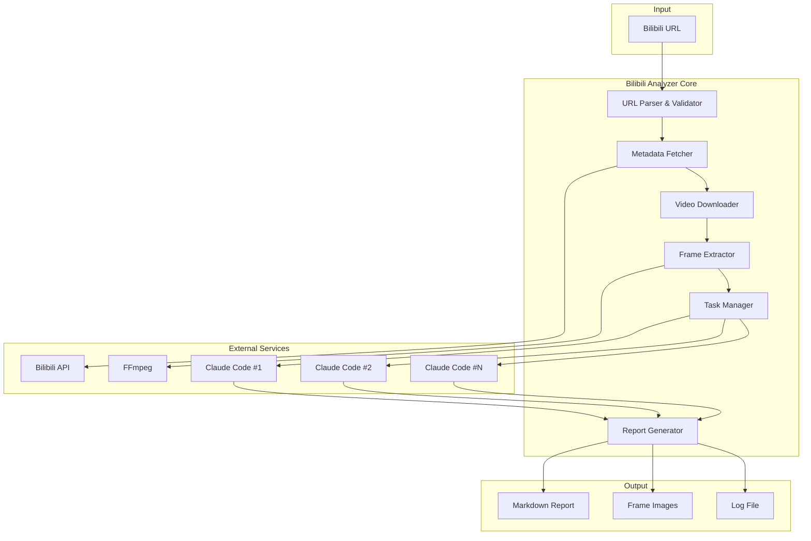

# Design Document: Bilibili Video Analyzer

## Overview

Bilibili视频分析器是一个Python命令行工具，用于自动化分析B站视频内容。系统采用模块化架构，包含视频下载、帧提取、AI并行分析和报告生成四个核心模块。

核心工作流程：
1. 用户提供B站视频URL
2. 系统验证URL并获取视频元数据
3. 下载视频到临时目录
4. 使用ffmpeg提取关键帧（支持场景检测）
5. 将帧分析任务分发给多个Claude Code实例并行处理
6. 汇总分析结果，生成带截图的Markdown报告

## Architecture



## Components and Interfaces

### 1. URLParser (URL解析器)

```python
class URLParser:
    """B站URL解析和验证"""
    
    @staticmethod
    def validate(url: str) -> bool:
        """验证URL是否为有效的B站视频链接"""
        pass
    
    @staticmethod
    def extract_bvid(url: str) -> str:
        """从URL中提取BV号"""
        pass
    
    @staticmethod
    def normalize_url(url: str) -> str:
        """将短链接转换为标准URL"""
        pass
```

### 2. MetadataFetcher (元数据获取器)

```python
@dataclass
class VideoMetadata:
    bvid: str
    title: str
    author: str
    author_id: str
    duration: int  # 秒
    description: str
    cover_url: str
    view_count: int
    like_count: int
    publish_time: str

class MetadataFetcher:
    """获取视频元数据"""
    
    def fetch(self, bvid: str) -> VideoMetadata:
        """通过BV号获取视频元数据"""
        pass
```

### 3. VideoDownloader (视频下载器)

```python
@dataclass
class DownloadResult:
    success: bool
    file_path: str
    file_size: int
    error_message: Optional[str]

class VideoDownloader:
    """视频下载模块"""
    
    def __init__(self, temp_dir: str, max_retries: int = 3):
        pass
    
    def download(self, bvid: str, on_progress: Callable) -> DownloadResult:
        """下载视频，支持进度回调"""
        pass
    
    def verify_integrity(self, file_path: str) -> bool:
        """验证下载文件完整性"""
        pass
```

### 4. FrameExtractor (帧提取器)

```python
@dataclass
class FrameInfo:
    frame_id: int
    timestamp: float  # 秒
    timestamp_str: str  # HH:MM:SS格式
    file_path: str
    is_scene_change: bool

@dataclass
class ExtractionResult:
    frames: List[FrameInfo]
    total_frames: int
    video_duration: float

class FrameExtractor:
    """使用ffmpeg提取视频帧"""
    
    def __init__(self, interval: int = 30, max_frames: int = 50):
        pass
    
    def extract(self, video_path: str, output_dir: str) -> ExtractionResult:
        """提取关键帧"""
        pass
    
    def detect_scenes(self, video_path: str) -> List[float]:
        """检测场景变化时间点"""
        pass
    
    @staticmethod
    def check_ffmpeg() -> bool:
        """检查ffmpeg是否可用"""
        pass
```

### 5. AIAnalyzer (AI分析器)

```python
@dataclass
class FrameAnalysis:
    frame_id: int
    timestamp: float
    description: str
    objects: List[str]
    text_content: List[str]
    people_count: int
    scene_type: str
    key_points: List[str]
    confidence: float

@dataclass
class AnalysisTask:
    task_id: str
    frame_info: FrameInfo
    status: str  # pending, running, completed, failed
    result: Optional[FrameAnalysis]
    retry_count: int

class AIAnalyzer:
    """AI帧分析模块"""
    
    def __init__(self, max_workers: int = 4, focus_areas: List[str] = None):
        pass
    
    def create_tasks(self, frames: List[FrameInfo]) -> List[AnalysisTask]:
        """为每个帧创建分析任务"""
        pass
    
    def analyze_frame(self, task: AnalysisTask) -> FrameAnalysis:
        """分析单个帧（调用Claude Code）"""
        pass
    
    def run_parallel(self, tasks: List[AnalysisTask]) -> List[FrameAnalysis]:
        """并行执行所有分析任务"""
        pass
    
    def aggregate_results(self, analyses: List[FrameAnalysis]) -> List[FrameAnalysis]:
        """按时间顺序聚合结果"""
        pass
```

### 6. ReportGenerator (报告生成器)

```python
@dataclass
class ReportConfig:
    output_dir: str
    video_title: str
    include_toc: bool = True
    include_summary: bool = True
    image_width: int = 800

class ReportGenerator:
    """Markdown报告生成器"""
    
    def __init__(self, config: ReportConfig):
        pass
    
    def generate(self, metadata: VideoMetadata, 
                 analyses: List[FrameAnalysis],
                 frames: List[FrameInfo]) -> str:
        """生成完整的Markdown报告"""
        pass
    
    def generate_summary(self, analyses: List[FrameAnalysis]) -> str:
        """生成执行摘要"""
        pass
    
    def generate_toc(self, sections: List[str]) -> str:
        """生成目录"""
        pass
    
    def copy_frames(self, frames: List[FrameInfo], dest_dir: str) -> None:
        """复制帧图片到输出目录"""
        pass
```

## Data Models

### 配置数据结构

```python
@dataclass
class AnalyzerConfig:
    """分析器配置"""
    frame_interval: int = 30          # 帧提取间隔（秒）
    max_frames: int = 50              # 最大帧数
    max_workers: int = 4              # 并行分析数
    output_dir: str = "./bilibili"    # 输出目录
    focus_areas: List[str] = None     # 分析焦点
    enable_scene_detection: bool = True
    download_retries: int = 3
    log_level: str = "INFO"
```

### 报告数据结构

```python
@dataclass
class VideoReport:
    """视频分析报告"""
    metadata: VideoMetadata
    frames: List[FrameInfo]
    analyses: List[FrameAnalysis]
    summary: str
    generated_at: str
    config: AnalyzerConfig
    status: str  # complete, partial, failed
    errors: List[str]
```

## Correctness Properties

*A property is a characteristic or behavior that should hold true across all valid executions of a system—essentially, a formal statement about what the system should do. Properties serve as the bridge between human-readable specifications and machine-verifiable correctness guarantees.*

### Property 1: URL Validation Correctness

*For any* string input, the URL validator SHALL correctly identify valid Bilibili URLs (matching `https://www.bilibili.com/video/BV*` or `https://b23.tv/*` patterns) and reject all other formats, returning appropriate error messages for invalid inputs.

**Validates: Requirements 1.1, 1.2, 1.3**

### Property 2: BV ID Extraction Round-Trip

*For any* valid Bilibili URL containing a BV ID, extracting the BV ID and reconstructing the URL SHALL produce a URL that resolves to the same video.

**Validates: Requirements 1.2**

### Property 3: Download Retry Behavior

*For any* download failure scenario, the downloader SHALL retry exactly up to the configured maximum (default 3) times with exponential backoff before reporting failure.

**Validates: Requirements 2.3, 2.4**

### Property 4: File Integrity Verification

*For any* successfully downloaded video file, the integrity verification SHALL return true only if the file is complete and uncorrupted.

**Validates: Requirements 2.5**

### Property 5: Frame Extraction Interval Consistency

*For any* video of duration D seconds with interval I, the frame extractor SHALL produce frames at timestamps approximately {0, I, 2I, ..., floor(D/I)*I} seconds, plus any scene change frames.

**Validates: Requirements 3.1, 3.3**

### Property 6: Frame Manifest Completeness

*For any* set of extracted frames, the manifest SHALL contain exactly one entry per frame with valid path, timestamp, and scene change indicator.

**Validates: Requirements 3.4**

### Property 7: Task-Frame Bijection

*For any* list of N extracted frames, the AI analyzer SHALL create exactly N analysis tasks, and after completion, return exactly N analysis results in temporal order.

**Validates: Requirements 4.1, 4.6**

### Property 8: Analysis Result Structure

*For any* completed frame analysis, the result SHALL contain all required fields: description, objects list, text content, people count, scene type, key points, and confidence score.

**Validates: Requirements 4.4**

### Property 9: Analysis Retry Behavior

*For any* failed analysis task, the analyzer SHALL retry exactly once before marking the task as failed.

**Validates: Requirements 4.5**

### Property 10: Report Content Completeness

*For any* generated report, it SHALL contain: video metadata (title, author, duration, URL), timeline-ordered content with embedded images using relative paths, and timestamps in HH:MM:SS format.

**Validates: Requirements 5.2, 5.3, 5.4, 5.5**

### Property 11: TOC-Section Consistency

*For any* generated report with table of contents, each TOC entry SHALL have a corresponding section header, and each section header SHALL have a TOC entry.

**Validates: Requirements 5.7**

### Property 12: Output Directory Creation

*For any* specified output path, if the directory does not exist, the report generator SHALL create it before writing files.

**Validates: Requirements 5.8**

### Property 13: Configuration Parameter Application

*For any* custom configuration values (frame interval, max frames, focus areas, output directory), the analyzer SHALL use these values instead of defaults throughout execution.

**Validates: Requirements 6.1, 6.2, 6.3, 6.4**

### Property 14: Error Logging Completeness

*For any* error that occurs during execution, the log SHALL contain a timestamp, error context, and the error message.

**Validates: Requirements 7.1, 7.3**

### Property 15: Partial Result Preservation

*For any* execution that fails after partial completion, the analyzer SHALL save all completed results and indicate incomplete status in the output.

**Validates: Requirements 7.4**

## Error Handling

### 错误类型层次

```python
class BilibiliAnalyzerError(Exception):
    """基础异常类"""
    pass

class URLValidationError(BilibiliAnalyzerError):
    """URL验证错误"""
    pass

class MetadataFetchError(BilibiliAnalyzerError):
    """元数据获取错误"""
    pass

class DownloadError(BilibiliAnalyzerError):
    """下载错误"""
    pass

class FFmpegError(BilibiliAnalyzerError):
    """FFmpeg相关错误"""
    pass

class AnalysisError(BilibiliAnalyzerError):
    """AI分析错误"""
    pass

class ReportGenerationError(BilibiliAnalyzerError):
    """报告生成错误"""
    pass
```

### 错误处理策略

| 错误类型 | 处理策略 | 用户提示 |
|---------|---------|---------|
| URL无效 | 立即返回 | 显示正确URL格式示例 |
| 视频不存在 | 立即返回 | 提示检查URL或视频是否被删除 |
| 下载失败 | 重试3次 | 显示重试进度，最终失败提示网络问题 |
| FFmpeg缺失 | 立即返回 | 提供安装命令 |
| 帧提取失败 | 跳过该帧 | 记录日志，继续处理 |
| AI分析失败 | 重试1次 | 标记为分析失败，继续其他帧 |
| 报告生成失败 | 保存原始数据 | 提示手动查看JSON数据 |

## Testing Strategy

### 测试框架选择

- **单元测试**: pytest
- **属性测试**: hypothesis (Python PBT库)
- **集成测试**: pytest + fixtures

### 单元测试覆盖

1. URL解析和验证逻辑
2. BV ID提取
3. 时间戳格式化
4. 配置参数处理
5. 报告Markdown生成

### 属性测试覆盖

每个属性测试配置运行100次迭代：

```python
from hypothesis import given, strategies as st, settings

@settings(max_examples=100)
@given(st.text())
def test_url_validation_property(url: str):
    """
    Feature: bilibili-analyzer, Property 1: URL Validation Correctness
    Validates: Requirements 1.1, 1.2, 1.3
    """
    # 测试实现
    pass
```

### 集成测试

1. 完整工作流测试（使用mock视频）
2. FFmpeg集成测试
3. 文件系统操作测试

### 测试数据

- 有效URL样本集
- 无效URL样本集
- 测试视频文件（短时长）
- Mock AI分析响应
